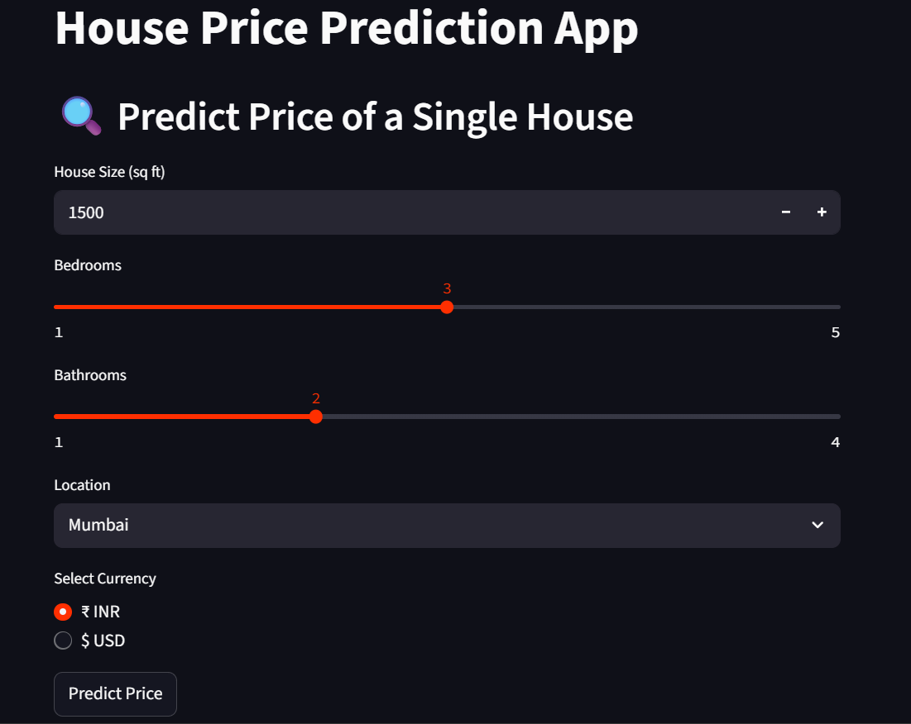
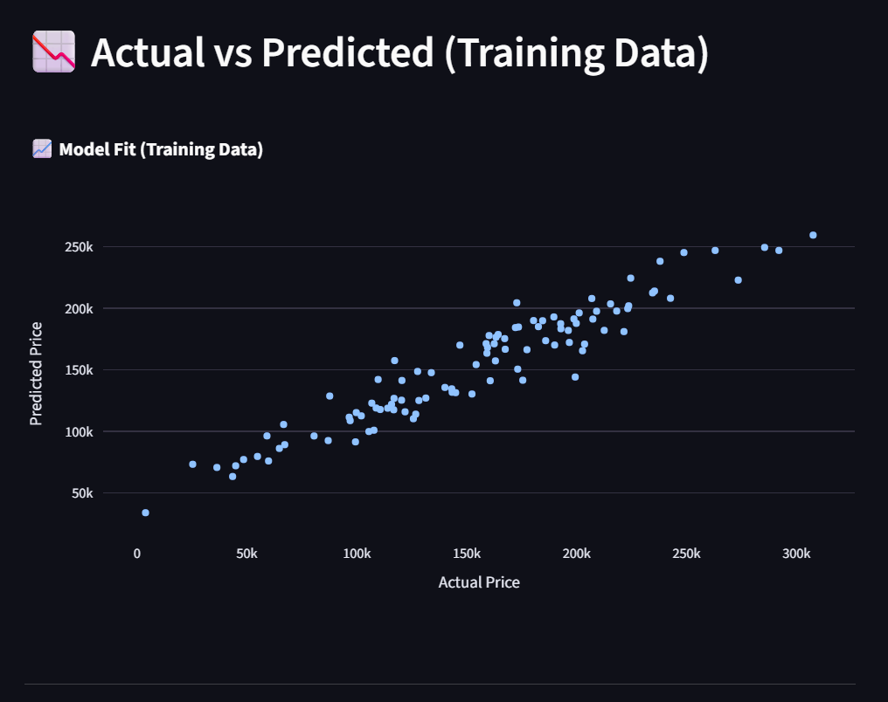
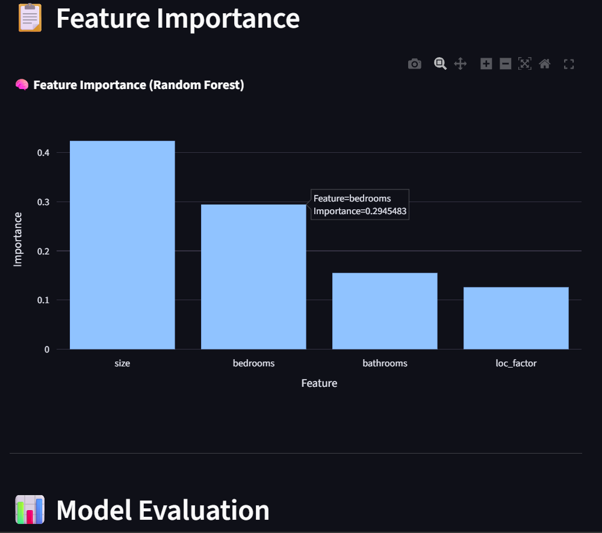

# 🏠 House Price Prediction App using Random Forest

An interactive and visually rich web application to **predict house prices** using a machine learning model (Random Forest Regressor). Built with **Streamlit**, this app takes user inputs and provides predictions with insights like **feature importance**, **model evaluation**, and a **scatter plot of actual vs predicted prices**.

---

## ✨ Features

✅ Predict house prices based on:

- 📐 Size of the house (sq ft)  
- 🛏️ Number of Bedrooms  
- 🚿 Number of Bathrooms  
- 📍 Location (Mumbai, Pune, Nagpur, Delhi)  

✅ Choose currency: ₹ INR / $ USD  
✅ Visualize feature importance using a bar chart  
✅ Actual vs Predicted Price scatter plot  
✅ Model Evaluation (MAE & RMSE)  
✅ Easy UI built with Streamlit  

---

## 📸 App Screenshots

### 🔍 Predict Price of a Single House  


### 📊 Actual vs Predicted Prices  


### 🧠 Feature Importance  


---

## 💡 How the Model Works

- **Synthetic dataset** is generated with features: `size`, `bedrooms`, `bathrooms`, `location`
- A **location factor** is assigned to each city to simulate cost variations:
  | City     | Location Factor |
  |----------|------------------|
  | Mumbai   | 1.5              |
  | Pune     | 1.2              |
  | Delhi    | 1.3              |
  | Nagpur   | 1.0              |
- A **Random Forest Regressor** is trained on this data  
- The model makes predictions and shows:
  - 💰 Estimated Price
  - 📉 Confidence Range (±20,000)
  - 📈 Feature Importance
  - 📉 MAE & RMSE on training data

---

## 🧪 Model Evaluation

| Metric | Value (approx) |
|--------|----------------|
| MAE (Mean Absolute Error) | ₹17,455 |
| RMSE (Root Mean Squared Error) | ₹21,731 |

📌 The Actual vs Predicted graph shows a strong correlation — model fits training data well.

---

## ⚙️ Tech Stack

- **Python 3.12**
- [Streamlit](https://streamlit.io/)
- [scikit-learn](https://scikit-learn.org/)
- [Pandas](https://pandas.pydata.org/)
- [NumPy](https://numpy.org/)
- [Plotly Express](https://plotly.com/python/plotly-express/)

---
--Run:https://houseprice-prediction-ben8cjflkmuwfdwqwts992.streamlit.app/
## 🚀 Run Locally

```bash
git clone https://github.com/Harishchandra-26/Houseprice-Prediction.git
cd Houseprice-Prediction
pip install -r requirements.txt
streamlit run main.py


